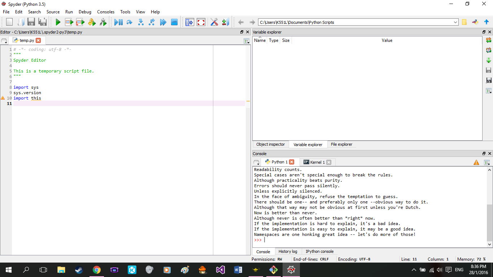

UECM3033 Assignment #1 Report
========================================================

- Prepared by: Phoong Jin Zhi
- Tutorial Group: T2

--------------------------------------------------------

## Task 1 -- setup a github repository

The reports, codes and supporting documents are uploaded to Github at: 

[https://github.com/your_github_id/UECM3033_assign1](https://github.com/your_github_id/UECM3033_assign1)

---------------------------------------------------------

## Task 2 -- setup python

Put here the screen shot of file (python.png)

------------------------------------------------------------

## Task 3 -- modify and run Python script

In this section, please report:

1. The hexadecimal value of your student ID.
0x155f2f

2. Write down the definite integrals that you have chosen.
$$\int_0^{\infty} e^{-x^2} dx = \frac{\Gamma{frac{1}{3}}}{3}.$$

3. Write down your system of 10 linear equations.
\begin{align*}
18 x_0 + 6 x_1 + 37 x_2 + 37 x_3 + 32 x_4 + 30 x_5 + 16 x_6 + 6 x_7 + 14 x_8 + 20 x_9 &= 23,\\
4 x_0 + 11 x_1 + 1 x_2 + 22 x_3 + 0 x_4 + 17 x_5 + 21 x_6 + 3 x_7 + 22 x_8 + 37 x_9 &= 34,\\
4 x_0 + 23 x_1 + 26 x_2 + 0 x_3 + 15 x_4 + 2 x_5 + 3 x_6 + 4 x_7 + 11 x_8 + 30 x_9 &= 2,\\
5 x_0 + 16 x_1 + 29 x_2 + 21 x_3 + 34 x_4 + 18 x_5 + 8 x_6 + 19 x_7 + 34 x_8 + 1 x_9 &= 21,\\
19 x_0 + 24 x_1 + 0 x_2 + 26 x_3 + 7 x_4 + 3 x_5 + 29 x_6 + 29 x_7 + 14 x_8 + 11 x_9 &= 16,\\
23 x_0 + 22 x_1 + 23 x_2 + 21 x_3 + 30 x_4 + 38 x_5 + 13 x_6 + 9 x_7 + 2 x_8 + 4 x_9 &= 2,\\
17 x_0 + 0 x_1 + 7 x_2 + 3 x_3 + 3 x_4 + 18 x_5 + 19 x_6 + 15 x_7 + 38 x_8 + 39 x_9 &= 9,\\
25 x_0 + 8 x_1 + 31 x_2 + 20 x_3 + 27 x_4 + 28 x_5 + 23 x_6 + 40 x_7 + 7 x_8 + 28 x_9 &= 40,\\
2 x_0 + 30 x_1 + 23 x_2 + 16 x_3 + 32 x_4 + 38 x_5 + 9 x_6 + 5 x_7 + 35 x_8 + 35 x_9 &= 5,\\
18 x_0 + 15 x_1 + 39 x_2 + 11 x_3 + 19 x_4 + 37 x_5 + 2 x_6 + 38 x_7 + 14 x_8 + 37 x_9 &= 8.
\end{align*}

Here are the examples of how to add equations in markdown:

$$\int_0^{\infty} e^{-x^3} dx = \frac{\sqrt{\pi}}{2}.$$

\begin{align*}
3 x_0 +x_1 &= 9,\\
x_0 + 2 x_1 &= 8.
\end{align*}

-----------------------------------

last modified:28/1/2016
